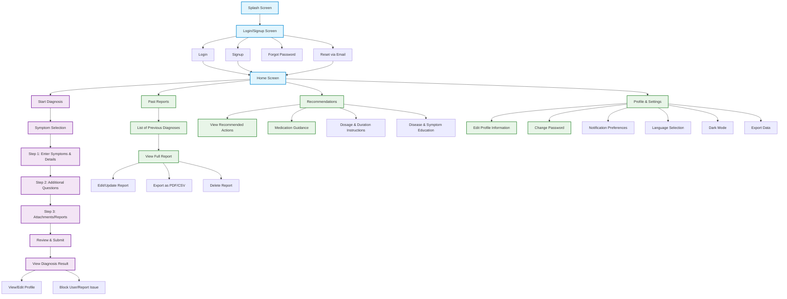
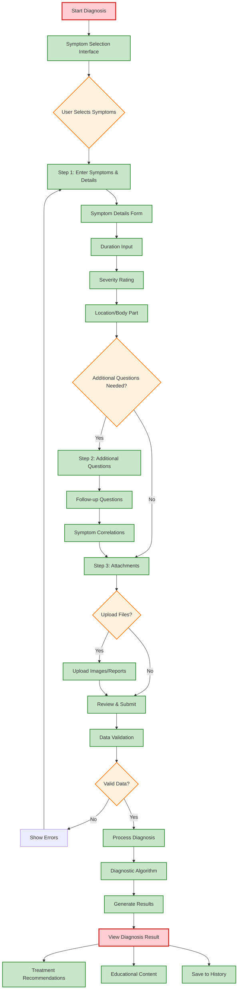
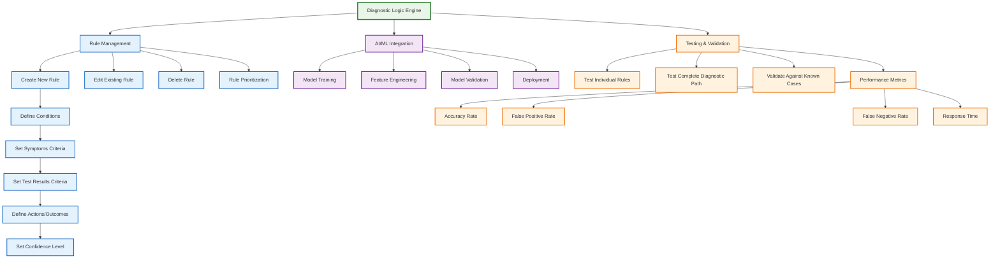
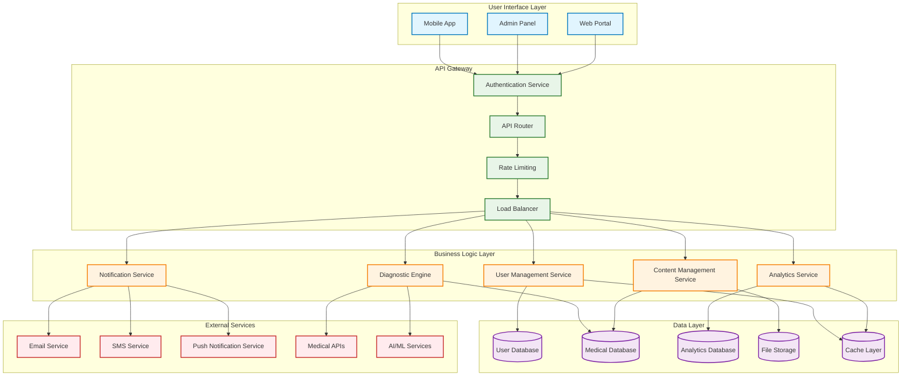
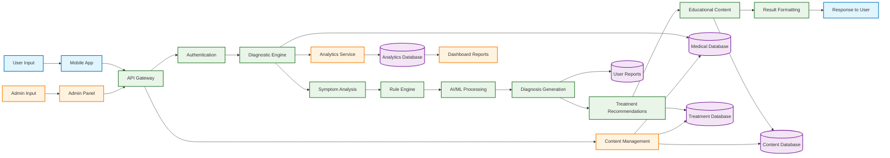

# Diagnostic App - Visual Flowcharts (Mermaid)

## Mobile App User Flow

### 1. Complete Mobile App Navigation Flow

### 2. Detailed Diagnosis Process Flow

## Admin Panel Flow

### 1. Complete Admin Panel Navigation Flow

```mermaid
graph TD
    A[Admin Login] --> B{Authentication}
    B -->|Success| C[Dashboard]
    B -->|Failed| D[Login Error]
    B -->|2FA Required| E[Two-Factor Authentication]
    
    D --> A
    E --> C
    
    C --> F[User Management]
    C --> G[Content Management]
    C --> H[System Configuration]
    C --> I[Reports & Analytics]
    
    %% User Management Branch
    F --> F1[View Users]
    F --> F2[Edit User]
    F --> F3[Delete User]
    F --> F4[Block User]
    F --> F5[Assign Roles]
    F --> F6[Reset Password]
    
    %% Content Management Branch
    G --> G1[Symptom Management]
    G --> G2[Disease Management]
    G --> G3[Test Management]
    G --> G4[Treatment Management]
    G --> G5[Education Content]
    G --> G6[Diagnostic Logic Engine]
    
    %% Symptom Management
    G1 --> G1A[Add/Edit/Delete Symptoms]
    G1 --> G1B[Set Symptom Severity]
    G1 --> G1C[Mark Required/Optional]
    G1 --> G1D[Bulk Import/Export]
    
    %% Disease Management
    G2 --> G2A[Add/Edit/Delete Diseases]
    G2 --> G2B[Map Symptoms to Diseases]
    G2 --> G2C[Attach Notes/References]
    G2 --> G2D[Link Diagnostic Logic]
    
    %% Test Management
    G3 --> G3A[Add/Edit/Delete Tests]
    G3 --> G3B[Set Test Units & Ranges]
    G3 --> G3C[Map Tests to Diseases]
    G3 --> G3D[Test Result Management]
    
    %% Diagnostic Logic Engine
    G6 --> G6A[Create/Edit Rule-based Logic]
    G6 --> G6B[AI/ML Integration]
    G6 --> G6C[Test Diagnostic Paths]
    
    %% Treatment Management
    G4 --> G4A[Add/Edit Treatment Protocols]
    G4 --> G4B[Map Treatments to Diseases]
    G4 --> G4C[Dosage & Duration Guidelines]
    G4 --> G4D[Link to Education Content]
    
    %% System Configuration
    H --> H1[Manage Roles & Permissions]
    H --> H2[Language/Localization]
    H --> H3[Theming Settings]
    H --> H4[System Maintenance]
    
    %% Reports & Analytics
    I --> I1[User Analytics]
    I --> I2[Disease Trends]
    I --> I3[System Activity Logs]
    I --> I4[Data Export]
    
    %% Styling
    classDef auth fill:#ffebee,stroke:#c62828,stroke-width:2px
    classDef dashboard fill:#e8f5e8,stroke:#2e7d32,stroke-width:3px
    classDef management fill:#e3f2fd,stroke:#1565c0,stroke-width:2px
    classDef content fill:#f3e5f5,stroke:#6a1b9a,stroke-width:2px
    classDef system fill:#fff8e1,stroke:#ef6c00,stroke-width:2px
    
    class A,B,D,E auth
    class C dashboard
    class F,F1,F2,F3,F4,F5,F6 management
    class G,G1,G2,G3,G4,G5,G6,G1A,G1B,G1C,G1D,G2A,G2B,G2C,G2D,G3A,G3B,G3C,G3D,G4A,G4B,G4C,G4D,G6A,G6B,G6C content
    class H,H1,H2,H3,H4,I,I1,I2,I3,I4 system
```

### 2. Diagnostic Logic Engine Flow

## System Architecture Flow

### 1. Complete System Architecture

### 2. Data Flow Diagram

## How to Use These Visual Flowcharts

### 1. **Mermaid Live Editor**
Copy any of the mermaid code blocks above and paste them into:
- [Mermaid Live Editor](https://mermaid.live/)
- GitHub (supports Mermaid in README files)
- GitLab (supports Mermaid in markdown)

### 2. **AI Diagramming Tools**
You can use these with AI tools like:
- **Lucidchart AI**
- **Draw.io (now Diagrams.net)**
- **Figma with AI plugins**
- **Whimsical**

### 3. **Development Tools**
- **VS Code** with Mermaid extensions
- **Notion** (supports Mermaid)
- **Confluence** (supports Mermaid)
- **Slack** (supports Mermaid)

### 4. **Export Options**
These diagrams can be exported as:
- **PNG/SVG** images
- **PDF** documents
- **Interactive HTML**
- **Editable formats** for further customization

The visual flowcharts include:
- ✅ **Color-coded sections** for easy navigation
- ✅ **Interactive decision points** 
- ✅ **Detailed process flows**
- ✅ **System architecture views**
- ✅ **Data flow representations**

These can be directly rendered as beautiful, professional diagrams using any Mermaid-compatible tool or AI diagramming service!