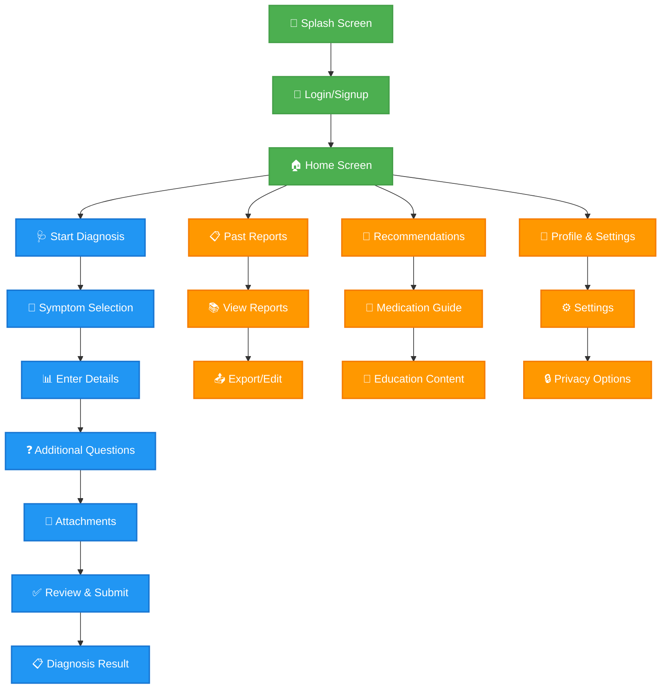
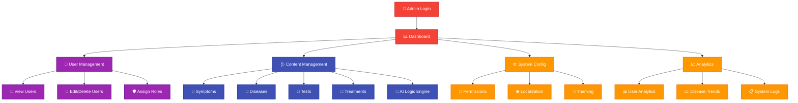
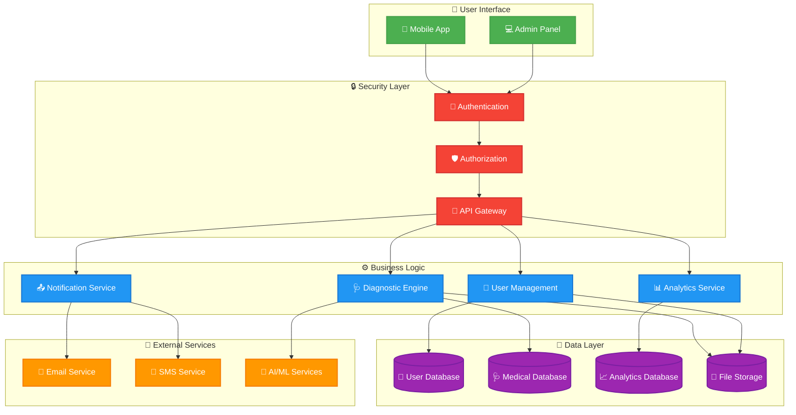
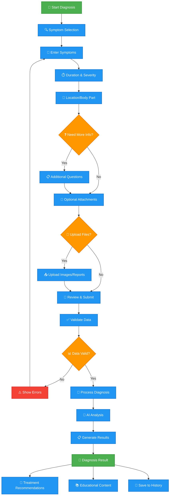
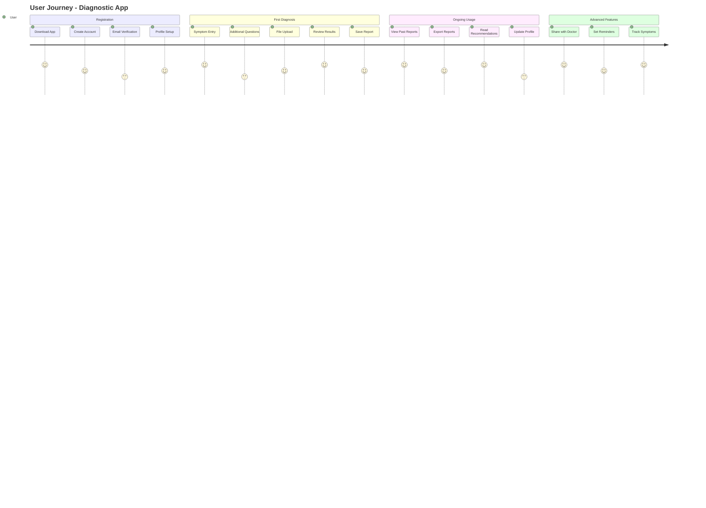

# Report-Ready Visual Diagrams

## 1. Mobile App User Flow (Main Overview)


## 2. Admin Panel Overview


## 3. System Architecture (High-Level)


## 4. Diagnosis Process Flow (Detailed)


## 5. User Journey Map


---

## 🎯 Instructions for Creating Visual Images:

### **Step 1: Copy the Mermaid Code**
- Copy any of the code blocks above (the parts between ```mermaid and ```)

### **Step 2: Generate Visual Image**
- Go to: **https://mermaid.live/**
- Paste the code in the left panel
- The visual diagram appears on the right
- Click **"Download PNG"** or **"Download SVG"**

### **Step 3: Customize (Optional)**
- Click **"Actions"** → **"Download PNG"** for high-resolution images
- Choose **SVG** for scalable vector graphics
- Select **PDF** for document embedding

### **Alternative Tools:**
- **Draw.io**: Import Mermaid code directly
- **Notion**: Paste Mermaid code blocks
- **GitHub**: Create README with Mermaid code

These diagrams are optimized for reports with:
- ✅ Clean, professional appearance
- ✅ Color-coded sections
- ✅ Icons for visual appeal
- ✅ High-resolution output
- ✅ Report-ready formatting